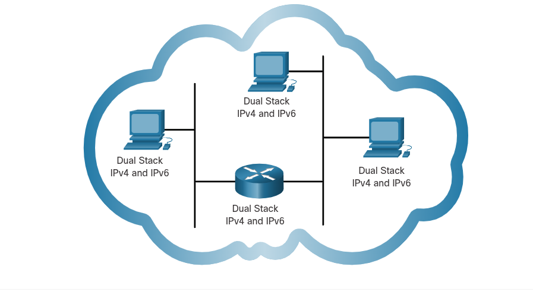
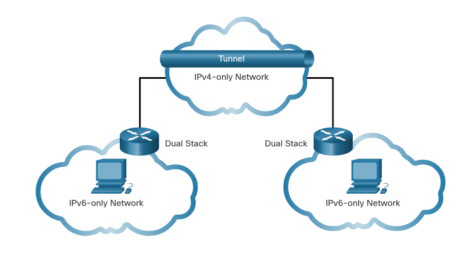
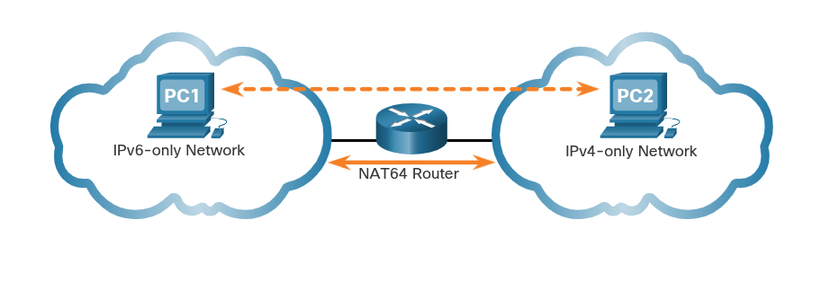

### IPv6 Addressing Formats and Rules
## IPv4 Issues
    (Regional Internet Registry) RIR IPv4 Exhaustion Dates
        - IPv6 is designed to be the successor to IPv4. IPv6 has a larger 128-bit address space, providing 340 undecillion (i.e., 340 followed by zeroes) possibles addresses. However, IPv6 is more than just larger addresses.
        - When the Internet Engineering Task Force (IETF) began its development of a successor to IPv4, it used this opportunity to fix the limitations of IPv4 and include enhancements. One example is Internet Control Message Protocol version 6 (ICMPv6), which includes address resolution and address autoconfiguration not found in ICMP for IPv4 (ICMPv4).
        - The depletion of IPv4 address space has been the motivating factor for moving to IPv6. As Africe, Asia and other areas of the world become more connected to the internet, there are not enough IPv4 addresses to accomodate this growth.
        - IPv4 has a theoretical maximum of 4.3 billion addresses. Private addresses in combination with Network Address Translation (NAT) have been instrumental in slwoing the depletion of IPv4 address space. However, NAT is problematic for many applications, creates latency and has limitations that severely impede peer-to-peer communications.
        - With the ever-increasing number of mobile devices, mobile providers habe been leading the way with the transition to IPv6. The top two mobile providers in the United States report that over 90% of their traffic is over IPv6.
        - Most top ISPs and content providers such as Youtube, Facebook, and Netflix, has also made the transition. Many companies like Microsoft, Facebook, and LinkedIn are transitioning to IPv6-only internally. In 2018, broadcast ISP Comcast reported a deployment of over 65% and British Sky Broadcasting over 86%.

    Internet of Thing (IoT)
        - The internet of today is significantly different than the internet of past decades. The internet of today is more than email, web pages, and file transfers between computers. The evolving internet is becoming an Internet of Things (IoT). No longer will the only devices accessing the internet be computers, tablets, and smartphones. The sensor-equipped, internet-ready devices of tomorrow will include everything from automobiles and biomedical devices, to household appliances and natural ecosystems.

# IPv4 and IPv6 Coexistence
    - The IETF has created various protocols and tools to help network administrators migrate their networks to IPv6. The migration techniques can be divided into three categories:
        - Dual stack
            - Allows IPv4 and IPv6 to coexist on the same network segment. Dual stack devices run both IPv4 and IPv6 protocol stack simultaneously. Known as native IPv6, this mean the customer network has an IPv6 connection to their ISP and is able to access content found on the internet over IPv6.
            

        - Tunneling
            - A method of transporting an IPv6 packet over an IPv4 network. The IPv6 packet is encapsulated inside an IPv4 packet, similar to other types of data.
            

        - Translation
            - Network Address Translation 64 (NAT64) allows IPv6-enabled devices to communicate with IPv4-enabled devices using a translation technique similar to NAT for IPv4. An IPV6 packet is translated to IPv4 packet and an IPv4 packet is translated to an IPv6 packet.
            

        Note: Tunneling and translation are for transitioning to native IPv6 and should only be used where needed.

# IPv6 Addressing
    - IPv6 addresses are represented using hexadecimal numbers. This base sixteen number system uses the digits 0 to 9 and the letters A to F:
        - 0 1 2 3 4 5 6 7 8 9 A B C D E F
    - In IPv6 addresses, these 16 digits are represented as hextets allowing us to represent these massive addresses in a much more readable format.

# IPv6 Formatting Rules
    16-bit Segments or Hextets
        - IPv6 addresses are much larger than IPv4 addressses, which is why we are unlikely to run out of them.
        - IPv6 addresses are 128 bits in length and written as a string of hexadecimal values. Every four bits is represented by a single hexadecimal digit; for a total of 32 hexadecimal values. IPv6 addresses are not case-sensitive and can be written in either lowercase or uppercase.
        

    Preferred Format
        - The preferred format for writing an IPv6 address is x:x:x:x:x:x:x:x, with each "x" consisting of four hexadecimal values. The term octet refers to the eight bits of an IPv4 address. In IPv6, a hextet is the unofficial term used to trefer to a segment of 16 bits, or four hexadecimal values.

            x = single hextet = 16 bits OR four hexadecimal digits.

        - Preferred format means that IPv6 is writen using all 32 hexadecimal digits. It does not necessarily mean that it is ideal method for representing the IPv6 address.
            - Examples of IPv6 in the preferred format:
                    2001 : 0db8 : 0000 : 1111 : 0000 : 0000 : 0000: 0200
                    2001 : 0db8 : 0000 : 00a3 : abcd : 0000 : 0000: 1234
                    2001 : 0db8 : 000a : 0001 : c012 : 9aff : fe9a: 19ac
                    2001 : 0db8 : aaaa : 0001 : 0000 : 0000 : 0000: 0000
                    fe80 : 0000 : 0000 : 0000 : 0123 : 4567 : 89ab: cdef
                    fe80 : 0000 : 0000 : 0000 : 0000 : 0000 : 0000: 0001
                    fe80 : 0000 : 0000 : 0000 : c012 : 9aff : fe9a: 19ac
                    fe80 : 0000 : 0000 : 0000 : 0123 : 4567 : 89ab: cdef
                    0000 : 0000 : 0000 : 0000 : 0000 : 0000 : 0000: 0001
                    0000 : 0000 : 0000 : 0000 : 0000 : 0000 : 0000: 0001
