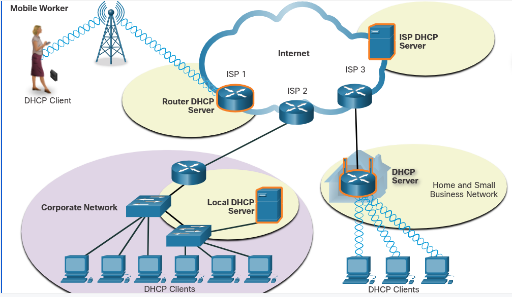

### Dynamic Addressing with DHCP
## Static and Dynamic Addressing
# Static IPv4 Address Assignment
    IPv4 addresses can be assigned either statistically or dynamically.
    With a static assignment, the network administrator must manually configure the network information for a host. At a minimum, this includes the following:
        IP address - This identifies the host on the network
        Subnet mask - This is used to identify the network on which the host is connected
        Default gateway - This identifies the networking device that the host uses to access the internet or another remote network.
    Static addresses have some advantages. For instance, they are useful for printers, servers, and other networking devices that nedd to be accessible to clients on the network. If hosts normally access a server at a particular IPv4 address, it would not be good if that address changed.
    Static assignment of addressing information can provide increased control of network resources, but it can be time consuming to enter the information on each host. When IPv4 addresses are entered statically, the host only performs basic error checks on the IPv4 address. Therefore, errors are more likely to occur.
    When using static IPv4 addressing, it is important to maintain an accurate list of which IPv4 addresses are assigned to which devices. Additionally, these are permanent addresses and are not normally reused.

# Dynamic IPv4 Address Assignment
    On local networks it is often the case that the user population changes frequently. New users arrive with laptops and need a connection. Others have new workstations that need to be connected. Rather than have the network administrator assign IPv4 addresses for each workstation, it is easier to have IPv4 addresses assigned automatically. This is done using a protocol known as Dynamic Host Configuration Protocol(DHCP).
    DHCP automatically assigns addressing information such as IPv4 address, subnet mask, default gateway, and other configuration information.
    DHCO is generally the preffered method of assigning IPv4 addresses to hosts on large networks because it reduces the burden on network support staff and virtually eliminates entry errors.
    Another benefit of DHCP is that an address is not permanently assigned to a host but is only leased for a period of time. If the host is powered down or taken off the network, the address is returned to the pool for reuse. This is especially helpful with mobile users that come and go on a network.

# DHCP Servers
    Various types of devices can be DHCP servers as long as they are running DHCP service software. With most medium to large networks, the DHCP server is usally a local dedicated PC-based server.
    With home networks, the DHCP server may be located at the ISP and a host on the home network receives it IPv4 configuration directly from the ISP.

    

    Many home networks and small businesses use a wireless router and modem. In this case, the wireless router is both a DHCP client and a server. The wireless router acts as a client to receive its IPv4 configuration from the ISP and then acts as a DHCP server for internal hosts on the local network. The router receives the public IPv4 address from the ISP, and in its role as a DHCP server, it distributes private addresses to internal hosts.
    In addition to PC-based servers and wireless routers, other types of networking devices such as dedicated routers can provide DHCP services to clients, although this is not as common.

## DHCPv4 Configuration
# DHCPv4 Operation
    DHCPv4 (Dynamic Host Configuration Protocol for IPv4) automates IP address assignment using a four-step DORA process (Discover, Offer, Request, Acknowledge)
