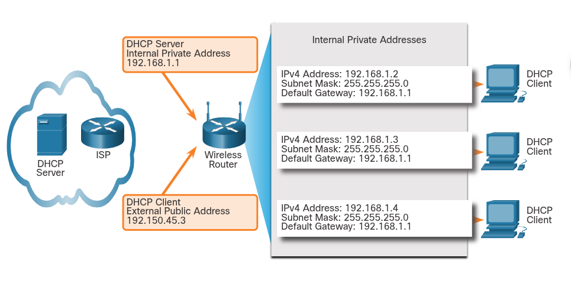

### Gateways to Other Networks
## Network Boundaries
# Routers as Gateways
    The router provides a gateway through which hosts on one network can communicate with hosts on different networks. Each interface on a router is connected to a separate network.
    The IPv4 address assigned to the interface identifies which local network is connected directly to it.
    Every host on a network must use the router as a gateway to other network. Therefore, each host must know the IPv4 address of the router interface connected to the network where the host is attached. This address is knows as the default gateway address. It can be either statically configured on the host or received dynamically by DHCP.
    When a wireless router is configured to be a DHCP server for the local network, it automatically sends the correct interface IPv4 address to the hosts as the default gateway address. In this manner, all hosts on the network can use that IPv4 address to forward messages to hosts located at the ISP and get access to hosts on the internet. Wireless routers are usually set to be DHCP servers by default.
    The IPv4 address of that local router interface becomes the default gateway address for the host configuration. The default gateway is provided, either statically or by DHCP.
    When a wireless router is configured as a DHCP server, it provides its own internal IPv4 address as the default gateway to DHCP clients. It also provides them with their respective IPv4 address and subnet mask.

# Routers as Boundaries Between Networks
    The wireless router acts as a DHCP server for all local hosts attached to it, either by Ethernet cable or wirelessly. These local hosts are reffered to as being located on an internal, or inside, network. Most DHCP servers are configured to assign private addresses to the hosts on the internal network, rather than internet routable public addresses. This ensures that, by default, the internal network is not directly accessible from the internet.
    The default IPv4 address configured on the local wireless router interface is usually the first host address on that network. Internal hosts must be assigned addresses within the same network as the wireless router, either statically configured , or through DHCP. When configured as a DHCP server, the wireless router provides addresses in this range. It also provides the subnet mask information and its own interface IPv4 address as the default gateway.
    Many ISPs also use DHCP servers to provides IPv4 addresses to the internet side of the wireless router installed at their customer sites. The network assigned to the internet side of the wireless router is referred to as the external, or outside, network.
    When a wireless router is connected to the ISP, it acts like a DHCP client to receive the correct external network IPv4 address for the internet interface. ISPs usually provide an internet-routable address, which enables hosts connected to the wireless router to have access to the internet.
    The wireless router serves as the boundary betwen the local internal network and the external internet.

    

## Network Address Translation (NAT)
