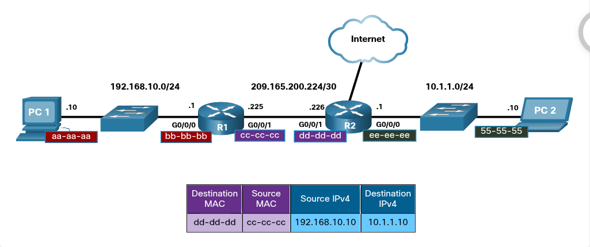

### The Arp Process

## Mac and IP
# Destination on Same Network
    Sometimes a host must send a message, but it only knows the IP address of the destination device. The host needs to know the MAC address of that device, but how can it be discovered? That is where address resolution becomes critical.
    There are two primary addresses assigned to a device on an Ethernet LAN:

        Physical address(the MAC address)
            Used for NIC-to-NIC communications on the same Ethernet network
        Logical address(the IP address)
            Used to send the packet from the source device to the destination device. The destination IP address may be on the same IP network as the source, or it may be on a remote network

    Layer 2 physical address (i.e., Ethernet MAC addresses) are used to deliver the data link frame with the encapsulated IP packet from one NIC to another NIC that is on the same network. If the destination IP address is on the same network, the destination MAC address will be that of the destination device.

# Destination on Remote Network
    When the destionation IP address (IPv4 or IPv6) is on a remote network, the destination MAC address will be the address of the host default gateway (i.e., the router interface).
        Examples:
            PC1 wants to send a packet to PC2. PC2 is located on remote network. Because the destination IPv4 address is not on the same local network as PC1, the destination MAC address is that of the local default gateway on the router.
            Routers examine the destination IPv4 address to determine the best path to forward the IPv4 packet. When the router receives the Ethernet frame, it de-encapsulates the Layer 2 information. Using the destination IPv4 address, it determines the next-hop device, and then encapsulates the IPv4 packet in a new data link frame for the outgoing interface.
            The host router would then encapsulate the packet with new Layer 2 address information.
            In the example below:

                

                R1 would now encapsulate the packet with new Layer 2 address information, as show in the figure above.
                The new destination MAC address would be that of the R2 GO/0/1 interface and the new source MAC address would be that of the R1 GO/0/1 interface.

                Along each link in a path, an IP packet is encapsulated in a frame. The frame is specific to the data link technology that is associated with that link, such as Ethernet. If the next-hop device is the final destination, the destination MAC address will be that of the device Ethernet NIC.

    NOTE: Address Resolution Protocol (ARP) is used to determine the device MAC address of a known destination device IPv4 address. Neighbor Discovery (NP) is used to determine the MAC address of a known destination device IPv6 address.

## Broadcast Containment
# Ethernet Braodcast
    An Ethernet Broadcast is when the destination MAC address is 48 one-bits, or in hexadecimal, all FS.
        Example:
            In a SOHO network with 2 switches, and each switches have 4 PCs. Switch A have a new PC labelled as PC4. PC4 is going to send a broadcast to all other devices. This might be a message that it needs all the devices in its network to receive. When a switch receives an Ethernet broadcast, it floods, or forwards, the Ethernet frame out all ports except the incoming port. The result is, all the devices in the network will receive the broadcast. If the SOHO have a router in the network, it will receive the broadcast also. However the router wil not forward the broadcast on to other network.

# Broadcast Domain
