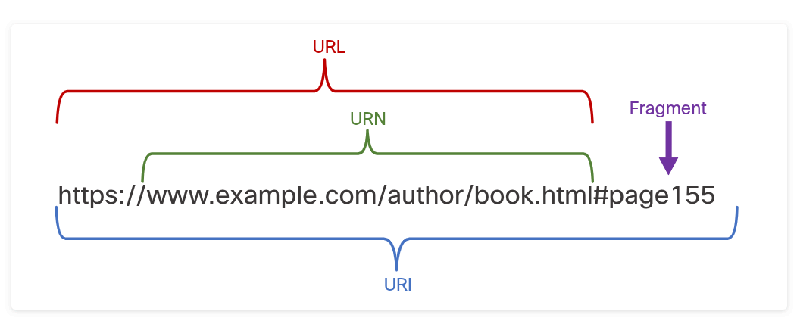

### Application Layer Services

## The Client Server Relationship
# Client and Server Interaction
    Most of the commonly used internet applications rely on complicated interactions between various servers and clients.
    The term server refers to a host running a software application that provides information or services to other hosts that are connected to the network. A well-known example of an application is a web server. There are millions of servers connected to the internet, providing services such as web sites, email, financial transactions, music downloads, etc. A crucial factor to enable these complex interactions to function is that they all use agreed upon standards and protocols.
    Below are the three common types of server software:

        Email
            The email server runs email server software. Clients use browser software such as mail client software, such as Microsoft Outlook, to access email on the server.
        Web
            The web server runs wen server software. Clients use browser software, such as Chrome or Firefox to access web pages on the server.
        File
            The file server stores corporate and user files in a central location. The client devices access these files with client software such as the Windows File Explorer.

# URI, URN, and URL
    Web resources and web services such as RESTful APIs are identified using a Uniform Resource Identifier (URI). A URI is a string of characters that identifies a specific network resource.

        Uniform Resource Name (URN)
            This identifies only the namespace of the resource (web page, document, image, etc.) without reference to the protocol
        Uniform Resource Locator (URL)
            This defines the network location of a specific resource on the network. HTTP or HTTPS URLs are typically used with web browsers. Other protocols such as FTP (File Transfer Protocol), SFTP (SSH File Transfer Protocol), SSH (Secure SHell), and others can be used as a URL. A URL using SFTP might look like: sftp://sftp.example.com.

        These are parts of a URI, as shown in the image below:

            Protocols/scheme   - HTTPS or other protocols such as FTP, SFTP, mailto and NNTP
            Hostname           - www.example.com
            Path and file name - /author/book.html
            Fragment           - #page155

            

