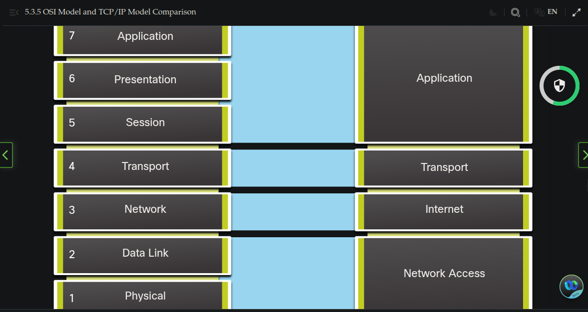

### Communication Principles ###

## Communication Protocols
- Just like humans, computers use rules, or protocols, in order to communicate. Protocols are required for computers to properly communicate across the network. In both a wired or wireless environment, a local network is defined as an area where all hosts must "speak the same language", which, in computer terms means they must "share a common protocol".

- Networking protocols define many aspects of communication over the local network.
    - Message format
        - When a message is sent, it must use a specific format or structure. Message formats depend on the type of message and the channel that it used to deliver message.

    - Message size
        - The rules that govern the size of the pieces communicated across the network are very strict. They can also be different, depending on the channel used. When a long message is sent from one host to another over a network. it may be necessary to break the message into smaller pieces in order to ensure that the message can be delivered reliably.

    - Timing
        - Many network communication functions are dependent on timing. Timing determines the speed at which the bits are transmitted across the network. It also affects when an individual host can send data and the total amount of data that can be sent in any transmissiion.

    - Encoding
        - Messages sent across the network are first converted into bits by the sending host. Each bit is encoded into a pattern of sounds, light waves, or electrical impulses depending on the network media over which the bits are transmitted. The destination host receives and decodes the signals in order to interpret the message.

    - Encapsulation
        - Each message transmitted on a network must include a header that contains addressing information that identifies the source and destination hosts, otherwise it cannot be delivered. Encapsulation is the process of adding this information to the pieces of data that make up the message. In addition to addressing, there may be other information in the header that ensures that the message is delivered to the correct application on the destination host.

    - Message pattern
        - Some messages require an acknowledgment before the next message can be sent. This type of request/response pattern is a common aspect of many networking protocols. However, there are other types of messages that may be simple streamed across the network, without concern as to whether they reach their destination.

# Communication Standards
- A standard is a set of rules that determines how something must be done. Networking and internet standards ensure that all devices connecting to the network implement the same set of rules or protocols in the same manner. Using standards, it is possible for different types of devices to send information to each other over the internent.

# Network Standards Organization
- An internet standard is the end result of a comprehensive cycle of discussion, problem solving, and testing. These different standards are developed, published, and maintained by a variety of organizations. When a new standard is proposed, each stage of the development and approval process is recorded in a numbered Requests for Comments(RFC) document so that the evolution of the standard is tracked. RFCs for internet standards are published and managed by the Internet Engineering Task Force (IETF).

## Network Communication Models
# The TCP/IP Model
- A layered model depicts the operation of the protocols occuring within each layer, as well as the interaction with the layers above and below it. The layered model has many benefits:
    - Asists in protocol design, because protocols that operate at a specific layer have defined information that they act upon and a defined interface to the layers above and below.
    - Fosters competition because products from different vendors can work together.
    - Enables technology changes to occur at one level without affecting the other levels.
    - Provides a common language to describe networking functions and capabilities.

-The first layered model for internetwork communications was created in the early 1970s and is referred to as the internet model. It defines four categories of functions that must occur in order for communications to be successful.
    - Application
        - Represents data to the user, plus encoding and dialog control.
    - Transport
        - Supports communication between various devices across diverse networks.
    - Internet
        - Determines the best path through the network.
    - Network Access
        - Controls the hardware devices and media that make up the network.

# The OSI Reference Model
- There are two basic types of models to describe the functions that must occur in order for network communicaitons to be successful: protocol models and reference models.
    - Protocol model
         - This model closely matches the structure of a particular protocol suite. A protocol suite includes the set of related protocols that typically provide all the functionality required for people to communicate with the data network. The TCP/IP model is a protocol model because it describes the functions that occur at each layer of protocols within the TCP/IP suite.
    - Reference model
        - This type of model describes the functions that must be completed at a particular layer, but does not specify exactly how a fucntion should be accomplished. A reference model is not intended to provide a sufficient level of detail to define precisely how each protocol should work at each layer. The primary purpose of a reference model is to aid in clearer understanding of the functions and processes necessary for network communications.

- The most widely known internetwork reference model was created by the Open Systems Interconnection (OSI) project at the International Organization for Standardization (ISO). It is used for data network design, operations specifications, and troubleshooting. This model is commonly referred to as the OSI model.

    7. Application
        - The application layer contains protocols used for process-to-process communications
    6. Presentation
        - The presentation layer provides for common representation of the data transferred between application layer services
    5. Session
        - The session layer provides services to the presentation layer to organize its dialogue and to manage data exchange
    4. Transport
        - The transport layer defines services to segment, transferm and reassemble the data for individual communications between the end devices
    3. Network
        - The network layer provides services to exchange the individual pieces of data over the network between identified end devices
    2. Data Link
        - The data link layer protocols describe methods for exchanging data frames between devices over a common media
    1. Physcial
        - The physical layer protocols describe the mechanical, electrical, functional, and procedural means to activate, maintain, and de-activate physical connections for a bit transmission to and from a network device.

# OSI Model and TCP/IP Comparison
- The TCP/IP model is a method of visualizing the interactions of the various protocols that make up the TCP/IP protocol suite. It does not describe general functions that are necessary for all networking communications. It describe the networking functions specific to those protocols in use in the TCP/IP protocol suite.

- The protocols that make up the TCP/IP protocol suite can be described in terms of the OSI reference model. The functions that occur at the internet layer in the TCP/IP model are contained in the network layer of the OSI Model. The transport layer functionality is the same between both models. However, the network access layer and the application layer of the TCP/IP model are further divided in the OSI model to describe discrete functions that must occur at these layers.

- The key similarities are in the transport and network layers; however, the two models differ in how they relate to the layers above and below each layer:
    - OSI Layer 3, the network layer, maps directly to the TCP/IP internet layer. This layer is used to describe protocols that address and mute messages through an internetwork
    - OSI Layer 4, the transport layer, maps directly to the TCP/IP transport layer. This layer describes general services and functions that provide ordered and reliable delivery of data betweek source and destination hosts.
    - The TCP/IP application layer includes several protocols that provides specific functionalitu to a variety of end user applications. The OSI model Layers 5, 6, and 7 are used as references for application software developers and vendors to produce applications that operate on networks.
    - Both the TCP/IP and OSI models are commonly used when referring to protocols at various layers. Because the OSI model separates the data link layer from the physical layer, it is commonly used when referring to the lower layers.
