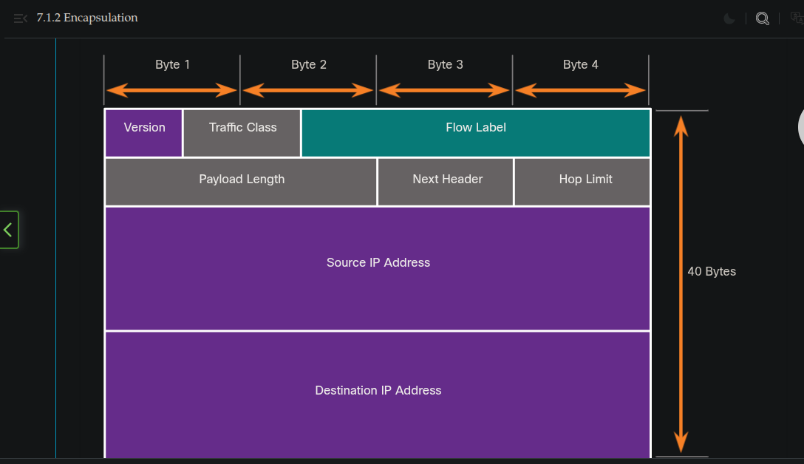

### The Access Layer
## Encapsulation and the Ethernet Frame
    - Encapsulation is the process of prepending protocol information with information from another protocol.
    - When an Ethernet frame is sent out an interface, the Destination MAC (Media Access Control) address indicates the MAC address of the device, which is on this network, that will receive the Eternet frame.
    - The Preamble and Start Frame Delimiter (SFD indicate the beginning of an Ethernet frame).
    - Ethernet operates at layer 2, the data link layer, of the OSI model.

# Encapsulation
    - The process of placing one message format (the letter) inside another message format (the envelope) is called encapsulation. De-encapsulation occurs when the process is reversed by the recipient and the letter is removed from the envelop. Just as a letter is encapsulated in an envelope for delivery, so computer messages are encapsulated.
    - Each computer message is encapsulated in a specific format, called a frame, before it is sent over the network. A frame acts like an envelope; it provides the address of the intended destination and the address of the source host. The forat and the contents of a frame are determined by the type of message being send and the channel over which it is communicated. Messages that are not correctly formatted are not successfully delivered to or processed by the destination host.
    - Analogy
        - A common example of requiring the correct format in human communication is when sending a letter. An envelope has the has the address of the sender and receiver, each located at the proper place on the envelop. If the destination address and formatting are not correct, the letter is not delivered.
    - Network
        - Similar to sending a letter, a message is sent over a computer network follows a specific format rules for it to be delivered and processed. Internet Protocol(IP) is a protocol with a similar function to the envelope example.

        

        - In the image above, the fields of the Internet Protocol version 6 (IPv6) packet identify the source of the packet and its destination. IP is responsible for sending a message from the message source to destination over one or more networks.

# The Access Layer
    - The access layer is the part of the network in which people gain access to other hosts and to shared filed and printers. The access layer provides the first line of networking devices that connect hosts to the wired Ethernet cable. Ethernet hubs contain multiple ports that are used to connect hosts to the network. Only one message can be sent through an Ethernet hub at a time. Two or more messages sent at the same time will cause a collision. Because excessive retransmission can clog up the network and slow down network traffic, hubs are now considered obsolete and have been replaced by Ethernet switches.
    - An Ethernet switch is a device that is used at Layer 2. When a host sends a message to another host connected to the same switched network, the switch accepts and decodes the frames to read the MAC address portion of the message. A table on the switch, called a MAC address table, contains a list of all the active ports and the host MAC addresses that are attached to them. When a message is sent between hosts, the switch checks to see if the destination MAC address is in the table. If it is, the switch builds a temporary connection, called a circuit, between the source and destination ports. Ethernet switches also allow for sending and receiving frames over the same Ethernet cable simultaneously. This improves the performace of the network by eliminating collisions.
    - A switch builds the MAC address table by examining the source MAC address of each frame that is sent between hosts. When a new host sends a message or responds to flooded message, the switch immediately learns its MAC address and the port to which it is connected. The table is dynamically updated each time a new source MAC address is read by the switch.
