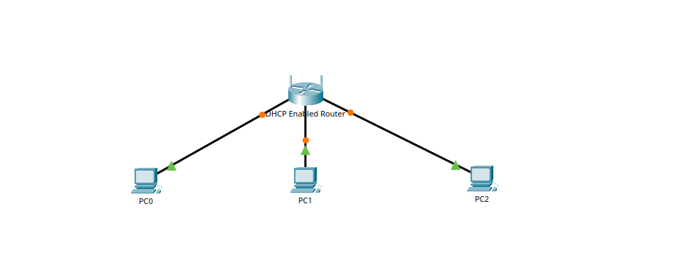

# Configure DHCP on a Wireless Router
## Overview
    - A home user wants to use a wireless router to connect 3 PCs. All 3 PCs should obtain their address automatically from the wireless router.

## Objectives
    - Connect 3 PCs to a wireless router

    - Change the DHCP setting to a specific network range

    - Configure the clients to obtain their address via DHCP

## Topology
    Describe the devices used:
    - 3 PCs
    - DHCP Enabled Router
    - 

## Configuration Summary
    - Wireless router configured with DHCP IPs
    - PCs and laptop assigned IPv4 addresses

## Verification
    - Successful connection to skillsforall.srv
    - 
