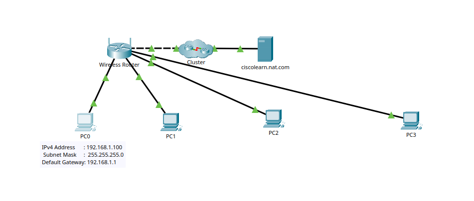
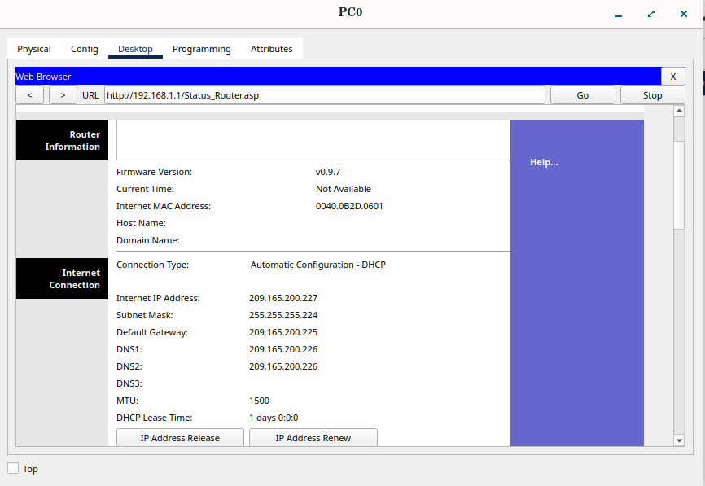
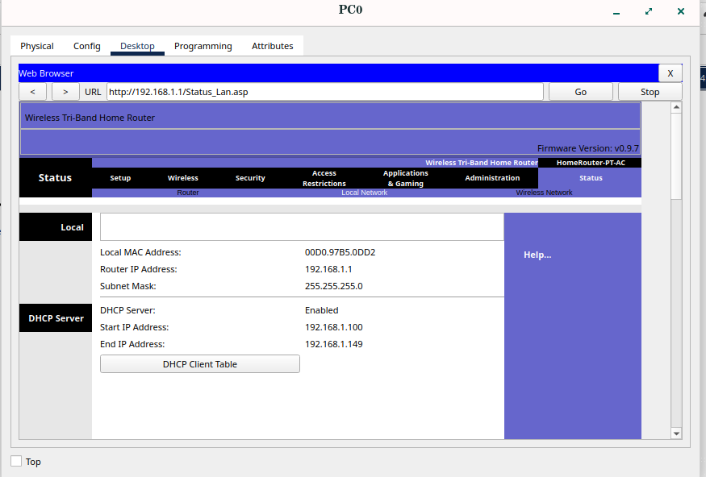
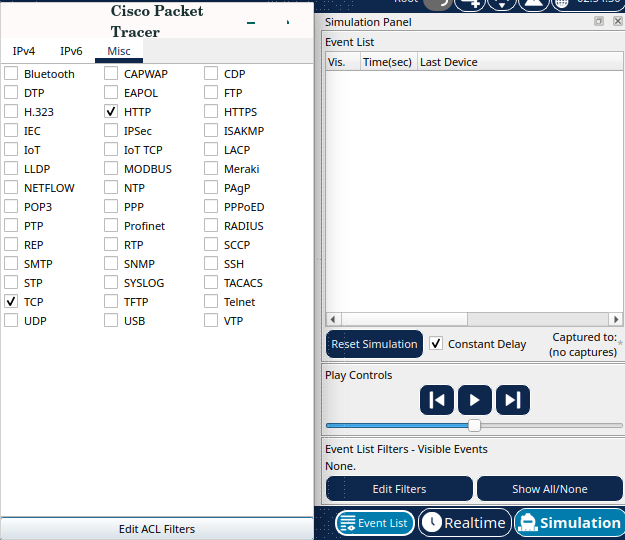
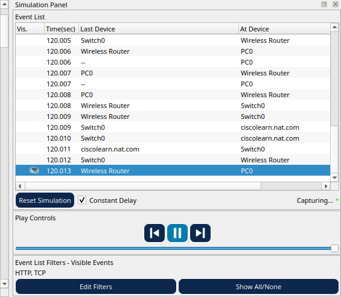
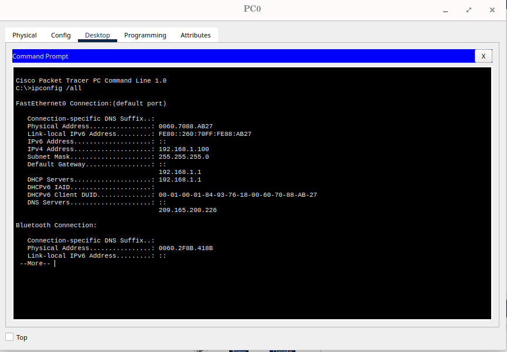
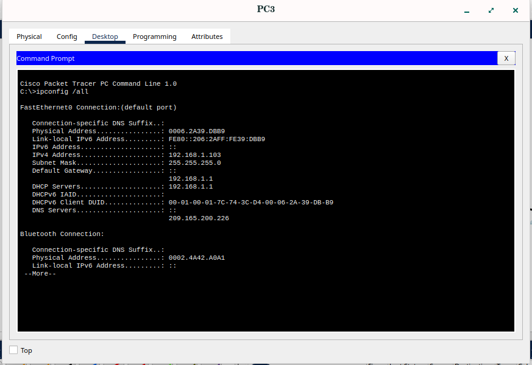
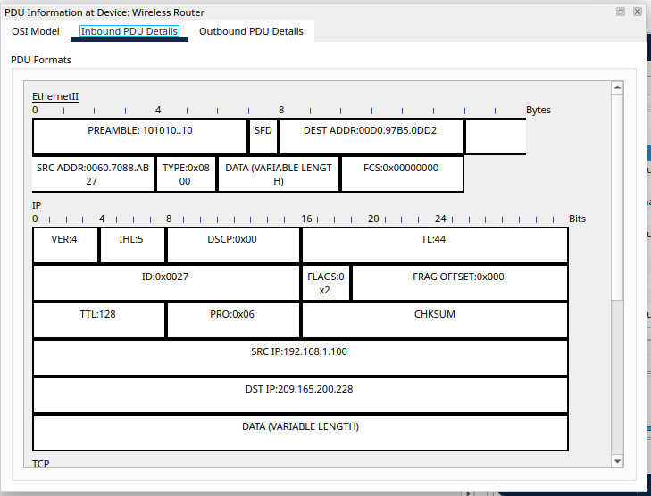
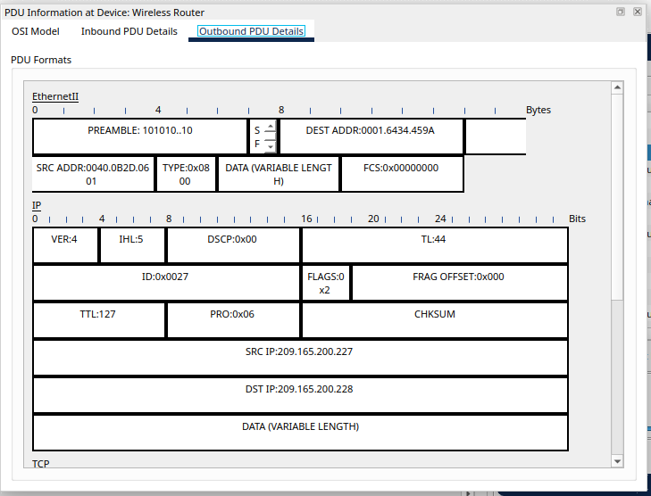

## Examine NAT on a Wireless Router
# Objectives
    Examine NAT configuration on a wireless router
    Set up 4 PCs to connect to a wireless router using DHCP
    Examine traffic that crosses the network using NAT

# Topology
    Describe the devices used:
        4 PCs
        1 Wireless Router
        

# Configuration Summary
    Wireless router configured with DHCP IPs
    Four PCs are assigned IPv4 addresses
    Configured public IP
        
    Configured local area network
        

    Setting up simulation panel (http and tcp) to capture NAT
        
        

# Verification
    Successful public and LAN network for the four PCs:
        PC0
            
        PC1
            
        PC2
            
        PC3
            

    Sucessful simulation
        
        
