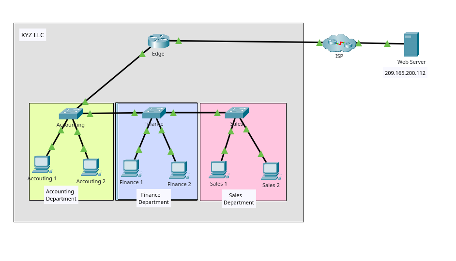
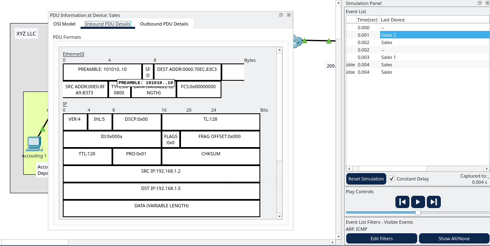
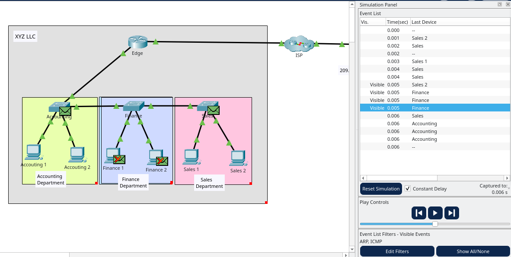
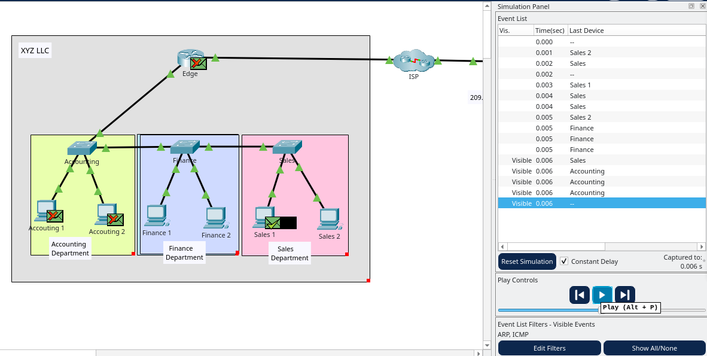

## Observe Traffic Flow in a Routed Network
## Overview
    - Propose a new network design for XYZ LLC

# Objectives
    Part 1: Observe Traffic Flow in an Unrouted LAN
    Part 2: Reconfigure the Network to Route Between LANs
    Part 3: Observe Traffic Flow in the Routed Network

# Topology
    Describe the devices used:
    - 1 Router
    - 3 Switches
    - 6 PCs

    - 

# Configuration Summary
    Part 1: Observe Traffic Flow in an Unrouted LAN
        What are the source and destination MAC and IP addresses for the frame and packet?

            

            The source MAC address is 00E0.8FA9.B373.
            The destination MAC address is 0060.70EC.83C3.
            The source IP address is 192.168.1.2.
            The destination IP address is 192.168.1.5.

        Which hosts and other types of devices needed to process the ARP request packets?

            
            

            The ARP request packets are also transmitted to the Finance and Accounting department switches. These switches then forward the requests to all connected devices, including Finance 1, Finance 2, Accounting 1, and Accounting 2.

        What is the impact of this on efficient operation of the network as it is currently configured?
            More traffic on the network and can slow the network performance.

    Part 2: Reconfigure the Network to Route Between LANs

