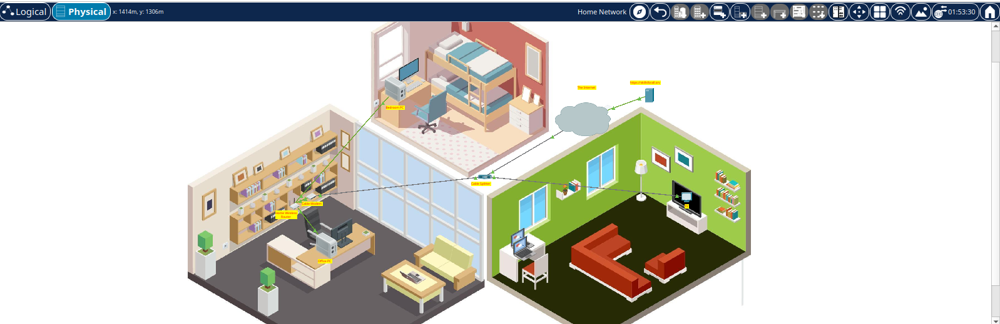
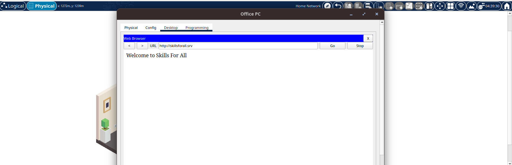

# Configure wired and wireless router for client

## Overview
How to set up Natsumi's new home to the cable TV network. You need to connect the correct cables to the correct devices, connect devices to a home wireless router, and configure the router to provide IP addresses to network clients. Natsumi also wants you to setup a wireless LAN for her home network, so you will configure that as well.

## Objectives
- Configure basic network topology
- Assign IP addresses
- Verify connectivity using Web Browser to connect to skillsforall.srv

## Topology
Describe the devices used:
- 2 PCs
- 1 Modem
- 1 Router
- 1 TV
- 1 Laptop

## Configuration Summary
- Wireless router configured with DHCP IPs
- PCs and laptop assigned IPv4 addresses

## Verification
- Successful connection to skillsforall.srv

