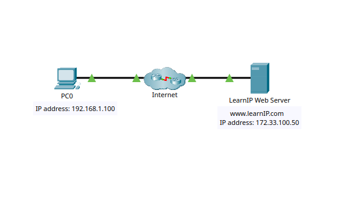
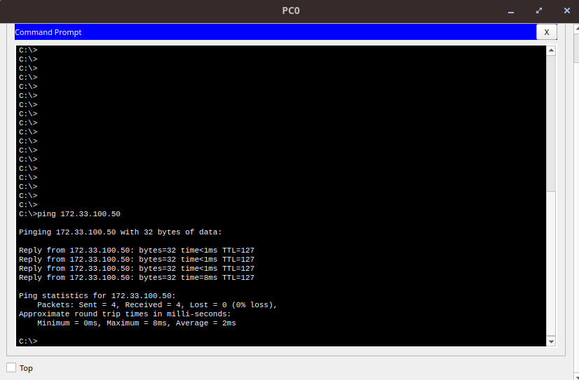
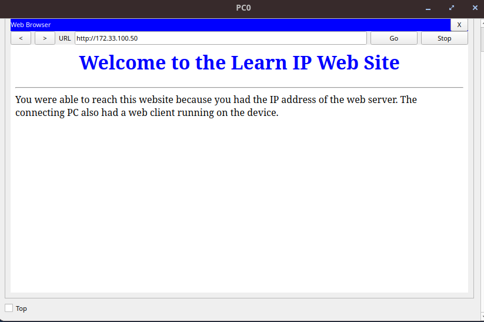

## Connect to a Web Server
# Objectives
    - To observe how packets are sent across the Internet using IP addresses.

# Topology
    - Describe the devices used:
        - 1 PC
        - Web Server
        

# Configuration Summary
    - Ping the web server
    - 

# Verification
    - Successful connection to 172.33.100.50
    - 
